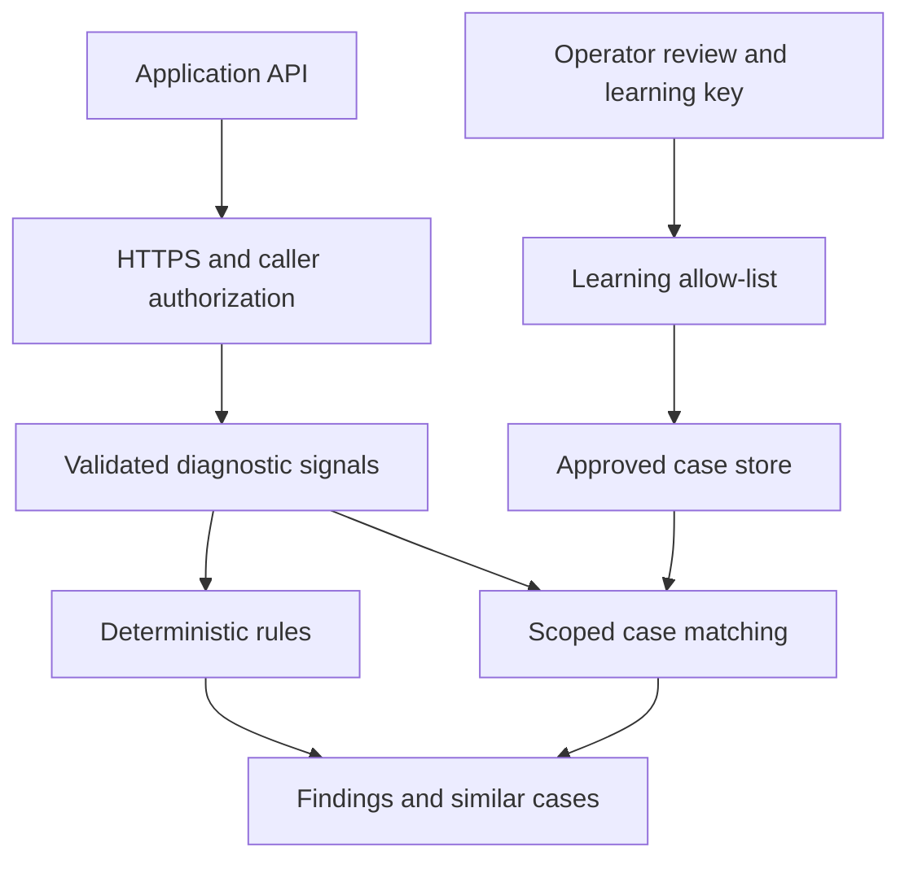

# Architecture

Application-owned APIs remain responsible for domain data and actions. SecureIntelligence receives selected diagnostic evidence, evaluates rules, and retrieves operator-approved cases. It has no application database credentials and no outbound AI integration.

## Authorization and request handling

Startup validates the diagnosis key and optional, separate learning key. The API pipeline performs routing, per-IP rate limiting, HTTPS enforcement outside Development, and key authorization before endpoint JSON binding. Static dashboard assets are served locally, require HTTPS outside Development, use a restrictive Content Security Policy, and contain no service key. The browser retains a supplied key only in memory; reload/disconnect clear it. Learning metadata protects feedback, case inspection and case deletion. Diagnosis keys cannot submit learning approval. Learning keys may also diagnose.

A 64 KiB Kestrel body limit bounds JSON parsing. Request validation limits text lengths and signal counts. Numeric parsing uses invariant culture; negative counts/latencies, NaN and infinities are invalid. Severity is serialized as a readable enum name.

Shared keys are a starter identity mechanism. They do not provide per-person attribution, per-application isolation, or an enterprise approval workflow. Integrators must replace or extend them for those needs. Development permits loopback HTTP for testing and must not be used as a production environment.

## Learning boundary

Only reviewed application names, issue types and typed signal keys can enter the store. Raw request descriptions are replaced with a fixed omission message. Unsupported signal keys cause a validation failure rather than silent loss of evidence. Causes and resolutions are generic, operator-reviewed text; basic checks reject common secret assignments, bearer credentials, email addresses and Malaysian IC formatting. This is not a complete redaction or personal-data detection system. Operator review remains essential.

Learning stores a case; it neither changes rules nor trains a model. The approved boolean is the caller's attestation. A separate learning key prevents an ordinary diagnosis caller from making that attestation, but the service cannot prove a human actually reviewed it.

## Review and publication

Callers can propose a sanitized candidate when learning is enabled. Candidates are stored as Pending and never enter case retrieval. A reviewer can edit the generic cause/resolution and explicitly approve; a single atomic state replacement records both the decision and active case. Repeated approvals are idempotent. Rejections never publish a case. The shared learning key identifies privileged access, so review timestamps are recorded but there is no per-person reviewer attribution yet.

Guides require explicit reviewer publication approval. Documents are scoped to an application and a supported issue or General, include a source reference, and optionally include a credential-free HTTPS source URL. Import is text only: there is no URL crawling, PDF parsing or provider call. The dashboard renders imported content as text, so HTML/Markdown cannot execute scripts. Operators still need to review content before publication.

## Retrieval

Cases must match application and issue type. Matching compares structured signals and never tokenizes a description or cause. Contradictory booleans and zero/nonzero numeric states exclude the case. Other numeric values use relative distance; missing keys reduce similarity. Results require a score of at least 0.6 and include matched/missing/different signal evidence. Primary order is signal similarity. Equal-similarity cases use a smoothed verified-outcome ratio, followed by stable case IDs. Outcomes are recorded only by reviewers, with one row per case/incident and corrections replacing the previous outcome. No evidence means no result.

Similarity is a heuristic retrieval score, not confidence, likelihood of a cause, or proof of a correct resolution. Returned cases are suggestions for an engineer to verify.

Knowledge retrieval uses bounded, Unicode-aware BM25 keyword scoring over source passages. It filters by application and issue before ranking. The diagnosis endpoint searches published guides using the issue, rule summaries and in-memory description, then returns exact passages and sources. Queries are not persisted, and the service generates no narrative answer. Scoring does not imply truth or confidence.

## Storage lifecycle

Cases, proposals, outcomes and documents share one versioned state envelope in the existing JSON file. Sanitized case arrays from the previous enhancement migrate on the next write; incomplete envelopes and original raw starter arrays fail closed. The JSON repository uses a process-local semaphore, unique temporary files, flushes and atomic replacement. Repeated equivalent feedback returns the stored case ID. Read/write operations prune expired cases and enforce capacity. Pending/reviewed proposals and outcomes share the case retention window. Published guides have explicit deletion and a separate capacity. Case deletion cascades to linked reviewed proposals and outcomes. Deletion removes data from the active file; it cannot erase filesystem backups.

Corrupt, null or legacy records fail closed with a generic 503 and leave the original file intact. Legacy cases containing raw descriptions require manual review and resubmission. There is no automatic migration that silently retains potentially sensitive fields.

This repository is for one process with a protected local data directory. It has no cross-process locking, database transactions, distributed rate limiter or scheduled retention worker. Use approved infrastructure for replicas and production retention requirements.

## Audit

API-operation logs contain method, response status and server trace identifier. They do not deliberately include request bodies, keys, causes, resolutions or description text. Storage error messages returned to callers are generic. The liveness endpoint checks the process only. Gateway, host and centralized logging settings require their own review; do not enable request-body logging.

## Future extension

Add rules via `IIntelligenceRule`, reviewed schemas via `SignalSchema`/`LearningPolicy`, and transactional storage via `ICaseRepository`. An optional classical CPU classifier can be introduced later, with offline evaluation and an explicit promotion step. None is included or required here.
